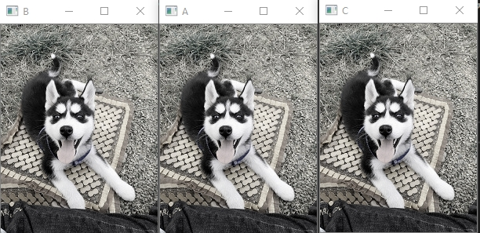
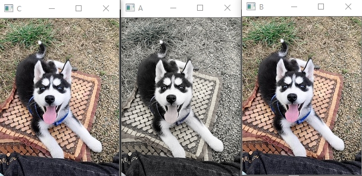
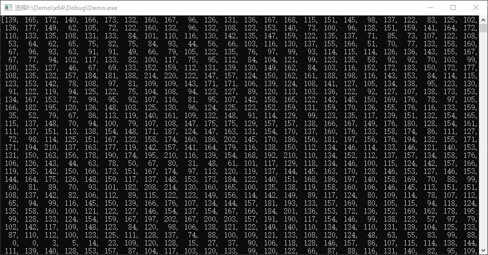

# Mat类

Mat类是用于保存图像以及其他矩阵的数据结构，默认情况下其尺寸为0。也可以初始化尺寸。

```c++
cv::Mat src;
std::cout << src.cols << ", " << src.rows << std::endl;
```

**0, 0**
**请按任意键继续. . .**


初始化尺寸

```c++
cv::Mat src(100, 100, CV_8U);
std::cout << src.cols << ", " << src.rows << std::endl;
```

**100, 100**
**请按任意键继续. . .**


## Mat类知识点

1. Mat是OpenCV转向C++后设计的图像类，替代原来的IplImage和cvMat。

2. Mat类由两个数据部分组成：

   - 矩阵信息头（包含矩阵尺寸、存储方法、存储地址等信息）
   - 指向存储像素值的指针

3. Mat的内存是自动分配和释放的

4. 为了减小在函数中传递图像的开销，Mat使用**引用计数机制**，每个Mat对象拥有自己的信息头，但是共享一个矩阵。拷贝构造函数只拷贝信息头和矩阵空间的指针。如果想完全拷贝举证，需要使用clone()或者copyTo函数。

   ```c++
   #include <iostream>
   #include <opencv2/opencv.hpp>
   void toGray(cv::Mat& img) {
   	for (int i = 0; i < img.rows; i++) {
   		for (int j = 0; j < img.cols; j++) {
   			img.at<cv::Vec3b>(i, j)[0] = (img.at<cv::Vec3b>(i, j)[0] + img.at<cv::Vec3b>(i, j)[1] + img.at<cv::Vec3b>(i, j)[2]) / 3;
   			img.at<cv::Vec3b>(i, j)[1] = (img.at<cv::Vec3b>(i, j)[0] + img.at<cv::Vec3b>(i, j)[1] + img.at<cv::Vec3b>(i, j)[2]) / 3;
   			img.at<cv::Vec3b>(i, j)[2] = (img.at<cv::Vec3b>(i, j)[0] + img.at<cv::Vec3b>(i, j)[1] + img.at<cv::Vec3b>(i, j)[2]) / 3;
   		}
   	}
   }
   int main() {
   	cv::Mat A = cv::imread(".\\imgs\\1.jpg");
   	cv::Mat B(A);
   	cv::Mat C = A;
   	toGray(A);
   	cv::imshow("A", A);
   	cv::waitKey();
   	cv::imshow("B", B);
   	cv::waitKey();
   	cv::imshow("C", C);
   	cv::waitKey();
   
   }
   // 对A的改变，也改变B C的像素值，说明它们的矩阵指针指向同一个矩阵地址
   
   ```

   结果

   

   可以看到当我们改变一个矩阵的数据时，其他矩阵也被改变了。

   使用clone()和copyTo试一下效果

   ```
   #include <iostream>
   #include <opencv2/opencv.hpp>
   void toGray(cv::Mat& img) {
   	for (int i = 0; i < img.rows; i++) {
   		for (int j = 0; j < img.cols; j++) {
   			img.at<cv::Vec3b>(i, j)[0] = (img.at<cv::Vec3b>(i, j)[0] + img.at<cv::Vec3b>(i, j)[1] + img.at<cv::Vec3b>(i, j)[2]) / 3;
   			img.at<cv::Vec3b>(i, j)[1] = (img.at<cv::Vec3b>(i, j)[0] + img.at<cv::Vec3b>(i, j)[1] + img.at<cv::Vec3b>(i, j)[2]) / 3;
   			img.at<cv::Vec3b>(i, j)[2] = (img.at<cv::Vec3b>(i, j)[0] + img.at<cv::Vec3b>(i, j)[1] + img.at<cv::Vec3b>(i, j)[2]) / 3;
   		}
   	}
   }
   int main() {
   	cv::Mat A = cv::imread(".\\imgs\\1.jpg");
   	cv::Mat B = A.clone();
   	cv::Mat C;
   	A.copyTo(C);
   	toGray(A);
   	cv::imshow("A", A);
   	cv::imshow("B", B);
   	cv::imshow("C", C);
   	cv::waitKey();
   
   }
   ```

   

5. Mat重载了 << 运算符

   ```c++
   #include <iostream>
   #include <opencv2/opencv.hpp>
   
   int main() {
   	cv::Mat A = cv::imread(".\\imgs\\1.jpg");
   	std::cout << A << std::endl;
   	system("pause");
   	return 0;
   
   }
   ```

   

6. Mat还可以用create创建

   ```c++
   Mat image = Mat();
   image.create(4, 4, CV_8UC3)
   ```

   此刻表示创建一个4x4大小的像素块，每个像素都是三通道每个通道的位数都是8位，一个字节的。上述CV_8UC3中的8表示8位、UC表示uchar类型、3表示三个通道。 

7. Mat常用构造函数

   ```c++
   Mat::Mat()
   //无参数构造方法；
   Mat::Mat(int rows, int cols, int type)
   //创建行数为 rows，列数为 col，类型为 type 的图像；
   Mat::Mat(Size size, int type)
   //创建大小为 size，类型为 type 的图像；
   Mat::Mat(int rows, int cols, int type, const Scalar& s)
   //创建行数为 rows，列数为 col，类型为 type 的图像，并将所有元素初始化为值 s；
   Mat::Mat(Size size, int type, const Scalar& s)
   //创建大小为 size，类型为 type 的图像，并将所有元素初始化为值 s；
   Mat::Mat(const Mat& m)
   //将 m 赋值给新创建的对象， 此处不会对图像数据进行复制， m 和新对象共用图像数据；
   Mat::Mat(int rows, int cols, int type, void* data, size_t step=AUTO_STEP)
   //创建行数为 rows，列数为 col，类型为 type的图像，此构造函数不创建图像数据所需内存， 而是直接使用 data 所指内存，图像的行步长由 step指定。
   Mat::Mat(Size size, int type, void* data, size_t step=AUTO_STEP)
   //创建大小为 size，：类型为 type 的图像，此构造函数不创建图像数据所需内存，而是直接使用 data 所指内存，图像的行步长由 step 指定。
   * Mat::Mat(const Mat& m, const Range& rowRange, const Range& colRange)
   //创建的新图像为 m 的一部分，具体的范围由 rowRange 和 colRange 指定， 此构造函数也不进行图像数据的复制操作， 新图像与 m 共用图像数据；
   * Mat::Mat(const Mat& m, const Rect& roi)
   //创建的新图像为 m 的一部分，具体的范围 roi 指定，此构造函数也不进行图像数据的复制操作，新图像与 m 共用图像数据。
   ```

   **这些构造函数中， 很多都涉及到类型type。 type可以是CV_8UC1， CV_16SC1， …，CV_64FC4 等。里面的 8U 表示 8 位无符号整数，16S 表示 16 位有符号整数，64F表示 64 位浮点数（即 double 类型） ；C 后面的数表示通道数，例如 C1 表示一个通道的图像，C4 表示 4 个通道的图像，以此类推。对于单通道图像，其元素类型一般为 8U（即 8 位无符号整数） ，当然也可以是 16S、32F 等；这些类型可以直接用 uchar、short、float 等 C/C++语言中的基本数据类型表达。**

8.  OpenCV 中有模板类 Vec，可以表示一个向量。OpenCV 中使用 Vec 类预定义了一些小向量，可以将之用于矩阵元素的表达。

   ```c++
   typedef Vec<uchar, 2> Vec2b;
   typedef Vec<uchar, 3> Vec3b;
   typedef Vec<uchar, 4> Vec4b;
   typedef Vec<short, 2> Vec2s;
   typedef Vec<short, 3> Vec3s;
   typedef Vec<short, 4> Vec4s;
   typedef Vec<int, 2> Vec2i;
   typedef Vec<int, 3> Vec3i;
   typedef Vec<int, 4> Vec4i;
   typedef Vec<float, 2> Vec2f;
   typedef Vec<float, 3> Vec3f;
   typedef Vec<float, 4> Vec4f;
   typedef Vec<float, 6> Vec6f;
   typedef Vec<double, 2> Vec2d;
   typedef Vec<double, 3> Vec3d;
   typedef Vec<double, 4> Vec4d;
   typedef Vec<double, 6> Vec6d;
   ```

9.    例如 8U 类型的 RGB 彩色图像可以使用 Vec3b，3 通道 float 类型的矩阵可以使用 Vec3f。
      对于 Vec 对象，可以使用[]符号如操作数组般读写其元素，如：

   ```c++
   Vec3b color; //用 color 变量描述一种 RGB 颜色
   color[0]=255; //B 分量
   color[1]=0; //G 分量
   color[2]=0; //R 分量
   ```

   