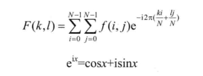
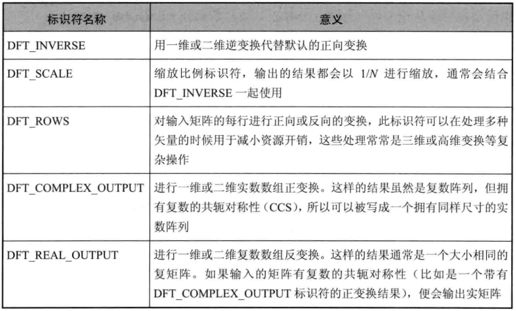

# 离散傅里叶变换

> Felix
>
> 2022.10.30


## 离散傅里叶变换的原理

将一副图像使用傅里叶变换就是将它分解成正弦和余弦两部分，将图像从空间域转换到频域。

**理论基础：**任一函数都可以表示成无数个正弦和余弦函数的和的形式。傅里叶变换就是一个用来将函数分解的工具。

二维图像的傅里叶变换可以用一下数学公式：



在频域里面，对于一副图像，高频部分代表了图像的细节、纹理信息；低频部分代表了图像的轮廓信息。傅里叶变换可以做的：图像增强、图像去噪、图像分割之边缘检测、图像特征提取、图像压缩。


## dft()

dft的作用是对一维或者二维浮点数组进行正向或反向傅里叶变换。

```c++
void dft(InputArray src, OutputArray dst, int flags=0, int nonzeroRows=0)
```

- **src:**输入矩阵，实数或者虚数

- **dst:**结果，尺寸和类型取决于标识符，即参数flags

- **flags:**转换的标识符，默认值0，取值如下：

  

- **nonzerosRow:**默认值0。