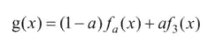
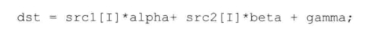

# 线性混合操作

> liuxiao
>
> 2022.9.25


###### 理论公式：



###### OpenCV实现：addWeighted()

该函数计算两个数组的加权和：

```c++
void addWeighted(InputArray src1, double alpha, InputArray src2, double beta,
                double gamma, OutputArray dst, int dtype=-1);
```

- **src1:**InputArray类型，表示需要加权的第一个数组，常常填一个Mat；
- **alpha:**表示第一个数组的权重；
- **src2:**InputArray类型，表示第二个数组，它需要和第一个数组拥有相同尺寸和通道数；
- **beta:**表示第二个数组的权重；
- **gamma:**一个加到权重总和上的标量值。下面有公式；
- **dst:**Output类型，输出的数组，它和输入的两个数组拥有相同的尺寸和通道数；
- **dtype:**输出阵列的可选深度，默认值-1。当两个输入数组具有相同的深度时，这是参数设置为-1。即等同于src1.depth()



###### 代码

```c++
/*
 * @Description: addWeighted()
 * @Author: liuxiao
 * @Date: 2022-09-25 21:58:17
 */

#include <opencv2/opencv.hpp>
#include <opencv2/imgproc/imgproc.hpp>
#include <iostream>

bool ROI_AddImage();
bool LinearBlending();
bool ROI_LinearBlending();

int main()
{
    system("color 5E");
    
    if (ROI_AddImage() && LinearBlending() && ROI_LinearBlending())
    {
        std::cout << std::endl << "run ok.";
    }
    cv::waitKey(0);
    return 0;
}

bool ROI_AddImage()
{
    cv::Mat srcImage1 = cv::imread("./imgs/1.jpg");
    cv::Mat logoImage = cv::imread("./imgs/4.jpg");
    if (!srcImage1.data) 
    {
        printf("读取srcImage1错误!\n");
        return false;
    }
    if (!logoImage.data)
    {
        printf("读取logoImage错误!\n");
        return false;
    }
    cv::Mat imageROI = srcImage1(cv::Rect(200, 250, logoImage.cols, logoImage.rows));
    cv::Mat mask = cv::imread("./imgs/4.jpg", 0);
    logoImage.copyTo(imageROI, mask);
    cv::namedWindow("<1>利用ROI实现图像叠加示例窗口");
    cv::imshow("<1>利用ROI实现图像叠加示例窗口", srcImage1);

    return true;
}

bool LinearBlending()
{
    double alphaValue = 0.5;
    double betaValue;
    cv::Mat srcImage2, srcImage3, dstImage;

    srcImage2 = cv::imread("./imgs/1.jpg");
    srcImage3 = cv::imread("./imgs/2.jpg");

    if (!srcImage2.data)
    {
        printf("读取srcImage2错误!\n");
        return false;
    }
    if (!srcImage3.data)
    {
        printf("读取srcImage3错误\n");
        return false;
    }

    betaValue = 1.0 - alphaValue;
    cv::addWeighted(srcImage2, alphaValue, srcImage3, betaValue, 0.0, dstImage);
    cv::namedWindow("<2>线性混合示例窗口", 1);
    cv::imshow("<2>线性混合示例窗口", dstImage);
    cv::waitKey(0);
    return true;
}

bool ROI_LinearBlending()
{
    cv::Mat srcImage4 = cv::imread("./imgs/1.jpg", 1);
    cv::Mat logoImage = cv::imread("./imgs/4.jpg");
    if (!srcImage4.data)
    {
        printf("读取srcImage4错误.\n");
        return false;
    }
    if (!logoImage.data)
    {
        printf("读取logoImage错误.\n");
        return false;
    }

    cv::Mat imageROI;
    imageROI = srcImage4(cv::Rect(200, 250, logoImage.cols, logoImage.rows));
    //方法二
    //imageROI = srcImage4(cv::Range(250, 250+logoImage.rows), cv::Range(200, 200+logoImage.cols));
    cv::addWeighted(imageROI, 0.5, logoImage, 0.3, 0.0, imageROI);
    cv::imshow("rst", srcImage4);
    cv::waitKey(0);
    return true;
}

```

