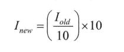

# 颜色空间缩减

> Felix
>
> 2022.7.6


颜色空间缩减就是：将现有颜色空间值除以某个输入值，以获得较少的颜色数。比如，颜色值0~9可取为新值0，10~19取10，以此类推。

如：uchar类型三通道图像，每个通道取值可以是0~255，于是就有256x256x256个不同的值**。可以定义:**

**0~9范围的像素值为0**

**10~19范围的像素值为10**

**20~29范围的像素值为20**

这样的操作将颜色取值降低为26x26x26种情况。

公式：



在处理图像时，遍历像素是要花时间的，所以这个换算可提前计算好：

```c++
int divideWith = 10;
uchar table[256];
for (int i = 0;i < 256; ++i) {
    table[i] = divideWidth * (i / divideWidth);
}

// 用的时候可以这样操作
p[j] = table[p[j]];
```

所以颜色空间算法步骤：

1. **遍历图像矩阵的每一个像素；**
2. **对像素应用上述公式。**