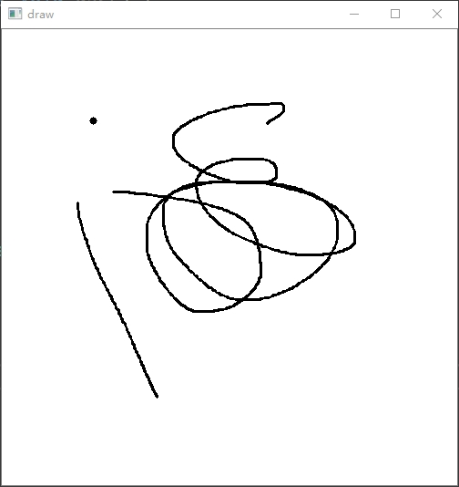

# OpenCV-鼠标操作

## 回调函数

```c++
CV_EXPORTS void setMouseCallback(const string& winname, MouseCallback onMouse, void* userdata = 0);
```

回调函数的作用是：每次在窗口上进行鼠标操作，都会调用此函数。

**parameters**

- **const string& winname**

  窗口名称，回调函数作用的窗口

- **MouseCallback onMouse**

  鼠标响应函数

- **void* usedata=0**

  鼠标响应处理函数ID，默认0


## code

```c++
#include <iostream>
#include <opencv2/opencv.hpp>

cv::Mat src;
const cv::String winname = "draw";

void on_mouse(int event, int x, int y, int flags, void*user);

int main() {
	src = cv::Mat(cv::Size(500, 500), CV_8UC3, cv::Scalar::all(255));
	cv::circle(src, cv::Point(100, 100), 4, cv::Scalar::all(0), -1);
	cv::namedWindow(winname, cv::WINDOW_AUTOSIZE);
	cv::imshow(winname, src);
	cv::setMouseCallback(winname, on_mouse, 0);
	while (1) {
		if (cv::waitKey() == 27)
			break;
	}
	system("pause");
	return 0;
}

// 这儿一定要设置成全局变量，因为每次的鼠标动作，程序都会重新调用回调函数，而不是一直在回调函数里的
bool isStartDrawLine = false;
cv::Point prePt;
cv::Point curPt;
void on_mouse(int event, int x, int y, int flags, void*user) {

	if (event == cv::EVENT_LBUTTONDOWN)
	{
		isStartDrawLine = true;
		prePt = cv::Point(x, y);
	}
	else if (event == cv::EVENT_MOUSEMOVE) {
		if (isStartDrawLine == true) {
			curPt = cv::Point(x, y);
			cv::line(src, prePt, curPt, cv::Scalar::all(0), 2);
			prePt = curPt;
		}

	}
	else if (event == cv::EVENT_LBUTTONUP) {
		isStartDrawLine = false;
	}
		
	cv::imshow(winname, src);
}
```




相关结构

```c++
enum MouseEventTypes {
       EVENT_MOUSEMOVE      = 0, //!< indicates that the mouse pointer has moved over the window.
       EVENT_LBUTTONDOWN    = 1, //!< indicates that the left mouse button is pressed.
       EVENT_RBUTTONDOWN    = 2, //!< indicates that the right mouse button is pressed.
       EVENT_MBUTTONDOWN    = 3, //!< indicates that the middle mouse button is pressed.
       EVENT_LBUTTONUP      = 4, //!< indicates that left mouse button is released.
       EVENT_RBUTTONUP      = 5, //!< indicates that right mouse button is released.
       EVENT_MBUTTONUP      = 6, //!< indicates that middle mouse button is released.
       EVENT_LBUTTONDBLCLK  = 7, //!< indicates that left mouse button is double clicked.
       EVENT_RBUTTONDBLCLK  = 8, //!< indicates that right mouse button is double clicked.
       EVENT_MBUTTONDBLCLK  = 9, //!< indicates that middle mouse button is double clicked.
       EVENT_MOUSEWHEEL     = 10,//!< positive and negative values mean forward and backward scrolling, respectively.
       EVENT_MOUSEHWHEEL    = 11 //!< positive and negative values mean right and left scrolling, respectively.
     };
```

```c++
enum MouseEventFlags {
       EVENT_FLAG_LBUTTON   = 1, //!< indicates that the left mouse button is down.
       EVENT_FLAG_RBUTTON   = 2, //!< indicates that the right mouse button is down.
       EVENT_FLAG_MBUTTON   = 4, //!< indicates that the middle mouse button is down.
       EVENT_FLAG_CTRLKEY   = 8, //!< indicates that CTRL Key is pressed.
       EVENT_FLAG_SHIFTKEY  = 16,//!< indicates that SHIFT Key is pressed.
       EVENT_FLAG_ALTKEY    = 32 //!< indicates that ALT Key is pressed.
     };
```

