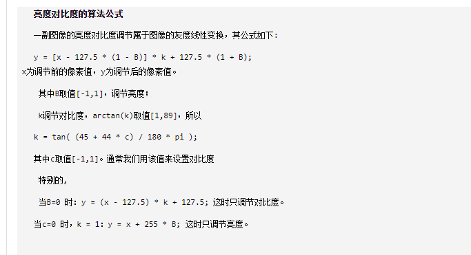

# 接近photoshop的亮度对比度调整算法

> Felix
>
> 2022.9.26


###### 算法

Algorithm of Brightness Contrast transformation
The formula is:
y = [x - 127.5 * (1 - B)] * k + 127.5 * (1 + B);

x is the input pixel value
y is the output pixel value
B is brightness, value range is [-1,1]
k is used to adjust contrast
k = tan( (45 + 44 * c) / 180 * PI );
c is contrast, value range is [-1,1]





###### code

```c++
#include <iostream>
#include "opencv2/core.hpp"
#include "opencv2/imgproc.hpp"
#include "opencv2/highgui.hpp"

using namespace std;
using namespace cv;


#define SWAP(a, b, t)  do { t = a; a = b; b = t; } while(0)
#define CLIP_RANGE(value, min, max)  ( (value) > (max) ? (max) : (((value) < (min)) ? (min) : (value)) )
#define COLOR_RANGE(value)  CLIP_RANGE(value, 0, 255)
#define M_PI 3.1415926

/**
 * Adjust Brightness and Contrast
 *
 * @param src [in] InputArray
 * @param dst [out] OutputArray
 * @param brightness [in] integer, value range [-255, 255]
 * @param contrast [in] integer, value range [-255, 255]
 *
 * @return 0 if success, else return error code
 */
int adjustBrightnessContrast(InputArray src, OutputArray dst, int brightness, int contrast)
{
	Mat input = src.getMat();
	if (input.empty()) {
		return -1;
	}

	dst.create(src.size(), src.type());
	Mat output = dst.getMat();

	brightness = CLIP_RANGE(brightness, -255, 255);
	contrast = CLIP_RANGE(contrast, -255, 255);

	/**
	Algorithm of Brightness Contrast transformation
	The formula is:
		y = [x - 127.5 * (1 - B)] * k + 127.5 * (1 + B);
		x is the input pixel value
		y is the output pixel value
		B is brightness, value range is [-1,1]
		k is used to adjust contrast
			k = tan( (45 + 44 * c) / 180 * PI );
			c is contrast, value range is [-1,1]
	*/

	double B = brightness / 255.;
	double c = contrast / 255.;
	double k = tan((45 + 44 * c) / 180 * M_PI);

	Mat lookupTable(1, 256, CV_8U);
	uchar *p = lookupTable.data;
	for (int i = 0; i < 256; i++)
		p[i] = COLOR_RANGE((i - 127.5 * (1 - B)) * k + 127.5 * (1 + B));

	LUT(input, lookupTable, output);

	return 0;
}


//=====主程序开始====

static string window_name = "photo";
static Mat src;
static int brightness = 255;
static int contrast = 255;

static void callbackAdjust(int, void *)
{
	Mat dst;
	adjustBrightnessContrast(src, dst, brightness - 255, contrast - 255);
	imshow(window_name, dst);
}


int main()
{
	src = imread("./imgs/1.jpg");

	if (!src.data) {
		cout << "error read image" << endl;
		return -1;
	}

	namedWindow(window_name);
	createTrackbar("brightness", window_name, &brightness, 2 * brightness, callbackAdjust);
	createTrackbar("contrast", window_name, &contrast, 2 * contrast, callbackAdjust);
	callbackAdjust(0, 0);

	waitKey();

	return 0;

}
```


###### 亮度对比度调节算法-2

原理1

​    对比度，简单的讲对比度反应了图片上亮区域和暗区域的层次感。而反应到图像编辑上，调整对比度就是在保证平均亮度不变的情况下，扩大或缩小亮的点和暗的点的差异。既然是要保证平均亮度不变，所以对每个点的调整比例必须作用在该值和平均亮度的差值之上，这样才能够保证计算后的平均亮度不变，故有调整公式：

​                                                **Out = Average + (In – Average) * ( 1 + percent)**

其中In表示原始像素点亮度，Average表示整张图片的平均亮度，Out表示调整后的亮度，而percent即调整范围[-1,1]。证明这个公式的正确性相当简单：

设图上有n个像素点，各个点亮度为Ai，平均亮度为A，变化率为alpha

​    但是实际处理中，并没有太多的必要去计算一张图的平均亮度：一来耗时间，二来在平均亮度上的精确度并不会给图像的处理带来太多的好处—-一般就假设一张图的平均亮度为128，即一半亮度，而一张正常拍照拍出来的图平均亮度应该是在[100,150]。在肉眼看来两者基本没有任何区别，而如果真实地去计算平均亮度还会带来很大的计算量。如下：

通过计算平均亮度来调整对比度

```c++
#include <iostream>
#include <opencv2/opencv.hpp>

void adjustBrightAndContrast(const cv::Mat& src, cv::Mat& dst, double level);
double clip3(double v, double min, double max);
int main() {
	cv::Mat src = cv::imread("./imgs/1.jpg");
	cv::imshow("src", src);
	cv::waitKey();
	cv::Mat dst = src.clone();
	adjustBrightAndContrast(src, dst, 0);
	cv::imshow("dst", dst);
	cv::waitKey();
	return 0;
}

double clip3(double v, double min, double max) {
	double ret = v;
	if (v < min)
		ret = min;
	if (v > max)
		ret = max;
	return ret;
}

void adjustBrightAndContrast(const cv::Mat& src, cv::Mat& dst, double level) {
	assert(level >= -1 && level <= 1);
	double rThresholdSum = 0, gThresholdSum = 0, bThresholdSum = 0;
	double detal = level + 1;
	int width = src.cols;
	int height = src.rows;
	for (int i = 0; i < height; ++i) {
		for (int j = 0; j < width; ++j) {
			rThresholdSum += src.at<cv::Vec3b>(i, j)[2];
			gThresholdSum += src.at<cv::Vec3b>(i, j)[1];
			bThresholdSum += src.at<cv::Vec3b>(i, j)[0];
		}
	}
	int pixNum = width * height;
	int rThreshold = (int)(rThresholdSum / pixNum);
	int gThreshold = (int)(gThresholdSum / pixNum);
	int bThreshold = (int)(bThresholdSum / pixNum);

	uchar rLookUp[256], gLookUp[256], bLookUp[256];
	for (int i = 0; i < 256; ++i) {
		rLookUp[i] = (uchar)clip3(rThreshold + (i - rThreshold) * detal, 0, 255);
		gLookUp[i] = (uchar)clip3(gThreshold + (i - gThreshold) * detal, 0, 255);
		bLookUp[i] = (uchar)clip3(bThreshold + (i - bThreshold) * detal, 0, 255);
	}
	for (int i = 0; i < height; ++i) {
		for (int j = 0; j < width; ++j) {
			dst.at<cv::Vec3b>(i, j)[0] = bLookUp[(int)dst.at<cv::Vec3b>(i, j)[0]];
			dst.at<cv::Vec3b>(i, j)[1] = gLookUp[(int)dst.at<cv::Vec3b>(i, j)[1]];
			dst.at<cv::Vec3b>(i, j)[2] = rLookUp[(int)dst.at<cv::Vec3b>(i, j)[2]];
		}
	}
}
```

