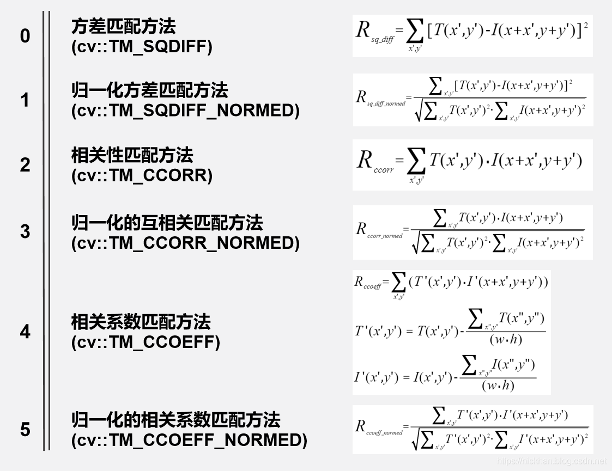
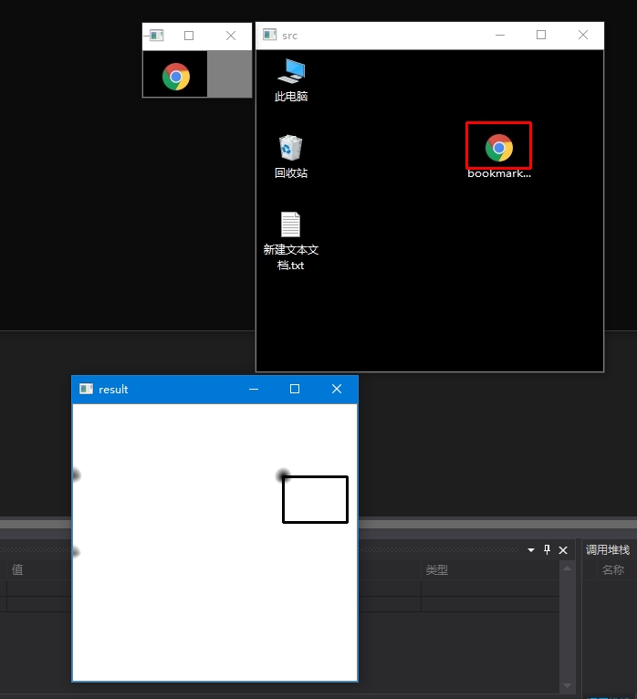

# 模板匹配

## OpenCV-matchTemplate

- **matchTemplate()**

  ```c++
  #include <opencv2/improc.hpp>
  void cv::matchTemplate (InputArray  image,
                          InputArray  templ,
                          OutputArray result,
                          int         method,
                          InputArray  mask=noArray()
                          )
  ```

  - image: 待匹配的图像，8U或32F
  - templ: 模板图像，与image类型相同，
  - result: 对比结果图，single-channel 32-bit floating-point。如果image尺寸是W x H，templ尺寸是w x h，则result尺寸是：(W - w + 1) x (H - h + 1) 。原因是因为，在匹配时，以模板大小的搜索框依次遍历整张图片时，每行需要遍历(W-w+1)次，每列需要遍历(H-h+1)。
  - method: 比较方法  **cv::TemplateMatchModes**


- method

  



​    **T** 代表模板图像，**I** 代表待匹配图像。

​    x ,y 代表当前搜索框在 **I** 矩阵中左上角元素的坐标。

​    x' ,y' 代表T和搜索框框出来的 **I** 的矩阵的元素坐标。


对公式研究发现：

 方差匹配方法：匹配度越高，值越接近于0。

    归一化方差匹配方法：完全匹配结果为0。
    相关性匹配方法：完全匹配会得到很大值，不匹配会得到一个很小值或0。
    归一化的互相关匹配方法：完全匹配会得到1， 完全不匹配会得到0。
    相关系数匹配方法：完全匹配会得到一个很大值，完全不匹配会得到0，完全负相关会得到很大的负数


- **code**

  ```c++
  #include <iostream>
  #include <opencv2/opencv.hpp>
  
  
  int main() {
  	cv::Mat src = cv::imread("imgs/2.jpg");
  	cv::Mat temp = cv::imread("imgs/3.jpg");
  	cv::imshow("src", src);
  	cv::imshow("temp", temp);
  	cv::waitKey();
  
  	int matchMethod = 1;
  	int resultW = src.cols - temp.cols + 1;
  	int resultH = src.rows - temp.rows + 1;
  	cv::Mat result;
  	result.create(resultH, resultW, CV_32FC1);
  	cv::matchTemplate(src, temp, result, matchMethod);
  	cv::normalize(result, result, 0, 1, cv::NORM_MINMAX, -1, cv::Mat());
  	cv::Point matchLoc;
  	double minVal, maxVal;
  	cv::Point minLoc;
  	cv::Point maxLoc;
  	cv::minMaxLoc(result, &minVal, &maxVal, &minLoc, &maxLoc, cv::Mat());
  	if (matchMethod == cv::TM_SQDIFF || matchMethod == cv::TM_SQDIFF_NORMED)
  	{
  		matchLoc = minLoc;
  	}
  	else {
  		matchLoc = maxLoc;
  	}
  	cv::rectangle(src, matchLoc, cv::Point(matchLoc.x + temp.cols, matchLoc.y + temp.rows), cv::Scalar(0, 0, 255), 2);
  	cv::rectangle(result, matchLoc, cv::Point(matchLoc.x + temp.cols, matchLoc.y + temp.rows), cv::Scalar::all(0), 2);
  	cv::imshow("src", src);
  	cv::imshow("result", result);
  	cv::waitKey();
  	system("pause");
  	return 0;
  }
  ```

  

  